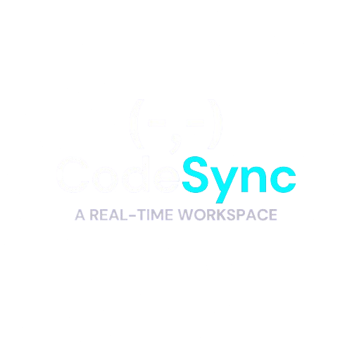

#  CodeSync: Real-Time Collaborative Cloud Editor & Execution Engine

<p align="center">
  
</p>

<p align="center">
  <strong>Next-Generation Real-Time Pair Programming, Low-Latency WebSocket Synchronization &amp; Multi-Language Code Compilation Engine</strong>
</p>

<p align="center">
  
  
  
  
  
  
</p>

---

##  Table of Contents
- [Overview](#-overview)
- [Key Features](#-key-features)
- [Supported Languages & Execution Runtime](#-supported-languages--execution-runtime)
- [Real-Time Synchronization & Room Lifecycle](#-real-time-synchronization--room-lifecycle)
- [Project Architecture & Directory Layout](#-project-architecture--directory-layout)
- [WebSocket & Event Matrix](#-websocket--event-matrix)
- [Getting Started](#-getting-started)
- [Code Execution API Specification](#-code-execution-api-specification)
- [Available Scripts](#-available-scripts)
- [Future Roadmap](#-future-roadmap)
- [Author & Connect](#-author--connect)
- [License](#-license)

---

##  Overview

Distributed software teams, coding interviewers, and student study groups often struggle with laggy screen shares, asynchronous code snippets, and fragmented tooling. 

**CodeSync** delivers a zero-friction, browser-based collaborative programming IDE engineered for speed, low latency, and ease of use:
* **Sub-Millisecond Synchronization**: Code edits are broadcasted instantly across all participants via WebSocket bi-directional channels.
* **Frictionless Collaboration**: Generate unique room IDs with a single click, share with peers, and start coding immediately without registration walls.
* **Server-Side Code Execution**: Run multi-language code snippets on the fly directly inside the editor and view stdout/stderr output in real time.
* **Clean Dark-Mode Workspace**: Sleek One Dark syntax theme, custom collaborator avatars, responsive sidebars, and fluid toast notifications.

---

##  Key Features

* **Instant Bi-Directional Sync**: Powered by Socket.io room pipelines with delta change tracking to prevent echo loops.
* **Multi-Language In-Browser Editor**: Built on CodeMirror v6 with full syntax highlighting, active line indicators, auto-closing brackets, and intelligent autocomplete.
* **Remote Code Execution Engine**: Secure sandboxed backend subprocess execution with execution timeout guards (5000ms threshold).
* **Live Presence Indicators**: Dynamic collaborator list displaying live participant counts and generated user avatar badges.
* **One-Click Clipboard Sharing**: Instantly copy room IDs to clipboard with toast confirmations to invite teammates quickly.
* **Graceful Disconnect Handling**: Immediate presence updates and room cleanup when teammates leave or disconnect.

---

##  Supported Languages & Execution Runtime

CodeSync supports on-the-fly execution across industry-standard programming languages:

| Language | CodeMirror Mode | Compiler / Interpreter | Runtime Command Pipeline |
| :--- | :---: | :--- | :--- |
| **C** | `@codemirror/lang-cpp` | `GCC` | `gcc temp/{id}.c -o temp/{id}.exe && temp\{id}.exe` |
| **C++** | `@codemirror/lang-cpp` | `G++` | `g++ temp/{id}.cpp -o temp/{id}.exe && temp\{id}.exe` |
| **Python** | `@codemirror/lang-python` | `Python 3` | `python temp/{id}.py` |
| **Java** | `@codemirror/lang-java` | `JDK (Javac / Java)` | `javac temp/{id}Main.java && java -cp temp {id}Main` |
| **JavaScript** | `@codemirror/lang-javascript`| `Node.js` | `node temp/{id}.js` |

---

##  Real-Time Synchronization & Room Lifecycle

CodeSync manages real-time socket connections through an optimized room subscription topology:

```
[ User Lands on Home Page ]
            │
            ├───────────────┬───────────────────────────────┐
            ▼                                               ▼
 [ Generates Unique Room ID ]                    [ Pastes Existing Room ID ]
            │                                               │
            └───────────────────────┬───────────────────────┘
                                    │
                                    ▼
                         [ Navigates to /editor ]
                                    │
                                    ▼
               [ Client Emits "join" { roomId, username } ]
                                    │
                                    ▼
       [ Server associates socket.id with username & joins room channel ]
                                    │
                                    ▼
          [ Server Broadcasts "joined" with active clients array ]
                                    │
         ┌──────────────────────────┴──────────────────────────┐
         ▼                                                     ▼
[ Code Edit Triggered ]                                [ User Leaves / Disconnects ]
         │                                                     │
         ▼                                                     ▼
[ Socket emits "CODE_CHANGE" ]                         [ "disconnecting" hook fires ]
         │                                                     │
         ▼                                                     ▼
[ socket.to(roomId).emit(...) ]                        [ Remaining users receive updated ]
(Prevents sender echo bounce)                          [ "joined" client list ]
```

---

##  Project Architecture & Directory Layout

```
Codesync-Collaborative-editor/
├── public/
│   ├── favicon.ico                # Browser tab icon
│   ├── index.html                 # HTML shell and root mounting point
│   ├── manifest.json              # Web app manifest
│   └── templatereal.png           # Brand logo and hero artwork
├── src/
│   ├── pages/
│   │   ├── editor.css             # Split-pane IDE styles, dark theme & output box
│   │   ├── Editorpage.js          # Main IDE workspace, CodeMirror, Socket listeners
│   │   ├── home.css               # Landing page, room invitation form styles
│   │   └── Home.js                # Hero section, UUID generator & room onboarding
│   ├── actions.js                 # Shared Socket event action constants
│   ├── App.css                    # Global application layout and resets
│   ├── App.js                     # React Router 7 declarative route setup
│   ├── client.js                  # Collaborator avatar tile component
│   ├── index.css                  # Typography and background aesthetics
│   ├── index.js                   # React 19 root bootstrap
│   └── socket.js                  # Dynamic Socket.io client instance initialization
├── temp/                          # Ephemeral execution workspace (auto-created)
├── .env                           # Local environment configuration
├── .gitignore                     # Git tracking exclusions
├── package.json                   # Dependencies, scripts & build configuration
├── README.md                      # Project documentation
├── server.js                      # Express HTTP + Socket.IO server & execution runner
└── test-socket.js                 # WebSocket verification utility
```

---

##  WebSocket & Event Matrix

| Event Name | Direction | Payload Schema | Functional Scope |
| :--- | :---: | :--- | :--- |
| `join` | Client $\rightarrow$ Server | `{ roomId: string, username: string }` | Registers user to the specified room channel. |
| `joined` | Server $\rightarrow$ Client | `{ clients: Array<{ socketId, username }> }` | Dispatches active participant roster to all room peers. |
| `CODE_CHANGE` | Client $\rightarrow$ Server | `{ roomId: string, code: string }` | Relays newly typed code to the server room buffer. |
| `CODE_CHANGE` | Server $\rightarrow$ Client | `{ code: string }` | Broadcasts new code to all peers (excluding sender). |
| `disconnecting` | Internal / Server | *Native Socket state* | Extracts remaining rooms and broadcasts updated user rosters. |

---

##  Getting Started

### 1. Prerequisites
* **Node.js**: `v18.x` or higher (tested on `v20.x` & `v24.x`)
* **npm**: `v9.x` or higher
* *(Optional for local multi-language execution)*: `gcc`, `g++`, `python`, `javac` installed in system `PATH`.

### 2. Clone the Repository
```bash
git clone https://github.com/VigneshDeekonda/Codesync-Collaborative-editor.git
cd Codesync-Collaborative-editor
```

### 3. Install Dependencies
Because the project leverages modern React 19 alongside Create React App tooling, install with:
```bash
npm install --legacy-peer-deps
```

### 4. Configure Environment
Create a `.env` file in the project root:
```env
REACT_APP_BASE_URL=http://localhost:5000
```
*(When running locally, CodeSync automatically detects `localhost` and routes WebSocket and compiler traffic to port 5000).*

### 5. Launch the Application

Run the backend server and frontend client in two separate terminal sessions:

**Terminal 1 — Backend & Execution Server:**
```bash
npm run server:dev
# or: node server.js
```
*Output: ` Server running on port 5000` & ` Socket.io ready`*

**Terminal 2 — React Client:**
```bash
npm start
```
*Automatically launches your default browser at `http://localhost:3000`.*

---

##  Code Execution API Specification

The backend server exposes a lightweight sandboxed code compilation endpoint:

* **Endpoint**: `POST /run`
* **Content-Type**: `application/json`
* **Timeout Limit**: `5000ms` (guarded against infinite loops)

### Request Payload:
```json
{
  "language": "javascript",
  "code": "console.log('Hello from CodeSync!');"
}
```

### Success Response:
```json
{
  "output": "Hello from CodeSync!\n"
}
```

### Error Response:
```json
{
  "output": "ReferenceError: x is not defined\n    at temp/1790536.js:1:13"
}
```

---

##  Available Scripts

| Command | Action |
| :--- | :--- |
| `npm start` | Starts the React frontend in development mode on `http://localhost:3000`. |
| `npm run server:dev` | Runs the backend server with `nodemon` for auto-reloading on port `5000`. |
| `npm run serve:prod` | Runs the backend server in production mode using `node server.js`. |
| `npm run build` | Compiles optimized production bundle assets into the `build/` directory. |
| `npm test` | Launches the interactive test runner. |

---

##  Future Roadmap

- [ ] **Dockerized Container Sandboxes**: Execute untrusted code inside isolated ephemeral Docker containers with strict memory limits.
- [ ] **WebRTC Voice & Video**: Integrated audio/video communication for seamless pair programming sessions.
- [ ] **Multi-Cursor Awareness**: Display remote collaborator cursor positions and active line selections in real time.
- [ ] **Interactive Terminal (Stdin)**: Support user input prompts (`cin`, `input()`, `readline`) via bidirectional terminal streaming.
- [ ] **Cloud Persistence**: Save workspaces, revision history, and user profiles with MongoDB / PostgreSQL.

---

##  Author & Connect

**Vignesh Deekonda**
* **GitHub**: [@VigneshDeekonda](https://github.com/VigneshDeekonda)
* **LinkedIn**: [Vignesh Deekonda](https://www.linkedin.com/in/vigneshdeekonda/)

---
